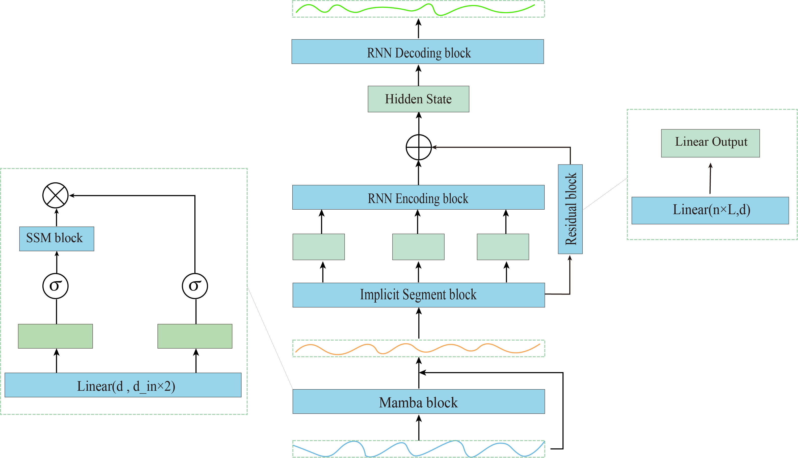
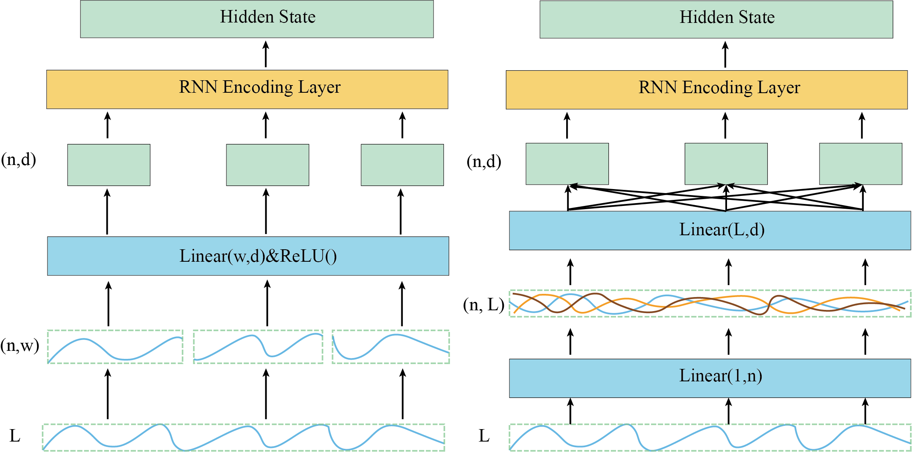
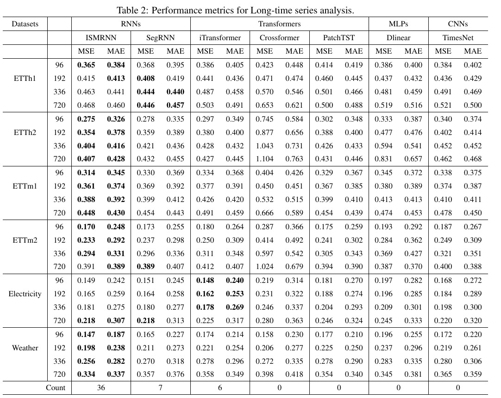

# ISMRNN

This is the official implement of ISMRNN, an Enhanced SegRNN model in "ISMRNN: An Implicitly Segmented RNN Method with Mamba for Long-Term Time Series Forecasting". The main code framework is from the official SegRNN code available at:https://github.com/lss-1138/SegRNN. And the official minimal implementation of Mamba can be found at:https://github.com/johnma2006/mamba-minimal. We would like to express our sincere gratitude.

We made several changes in SegRNN models to enhance it's behavior when the look-back windows is short:

- We add the mamba structure to preprocessing the time series data.
- We replace the fixed segmentation of SegRNN into implicit Segmentation, which allows a dense information processing in the Segmentation Stage.
- We add a residual block from time series to encoder output, reduce the information loss in the RNN structure.

The overall structure is shown as follow:

The implicit segmentation we used is shown as follow:

By enhancing these three changes, we conduct the experiments, the result is shown as follow:

To use the ISMRNN, first:
- create a dataset file and add the corresponding datasets.
- git clone https://github.com/UniqueoneZ/ISMRNN.git.
- cd the ISMRNN file locaion.
- pip install -r requirements.txt
- sh run_main.sh

Note that there is a certain variance in the experimental data for the model, and the hyperparameters have not yet been finely tuned. We will continue to improve this work in the future.

# Acknowledge
We sincerely thank the following GitHub repositories for providing valuable code and test data：
https://github.com/lss-1138/SegRNN.git
